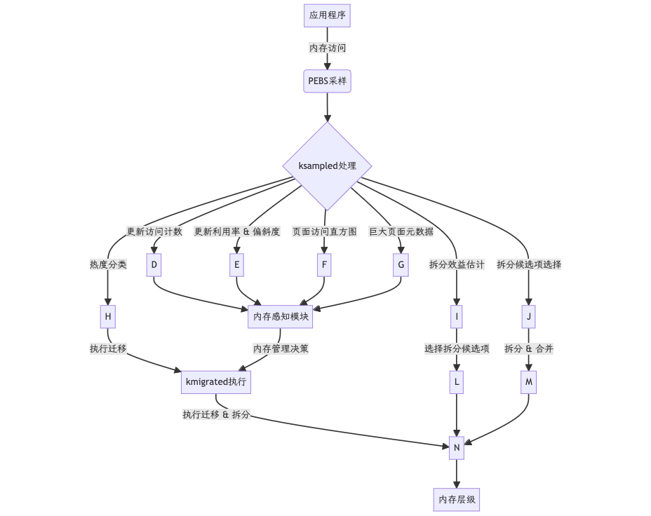

# MEMCOS项目文档

##  目标描述
本项目旨在开发一个高效的多层级内存管理系统，通过结合最新的研究成果，优化大规模数据中心的内存使用效率和性能。我们的目标是实现一个能够自动管理DRAM和NVM等不同类型内存的系统，以降低成本、提高性能，并保持应用透明性。

##  比赛题目分析与相关资料调研
- **题目分析**：分析当前数据中心内存使用情况，确定需要解决的关键问题，如内存访问延迟、内存带宽限制等。

- **Memtis**: [3613167](https://dl.acm.org/doi/pdf/10.1145/3600006.3613167) 

- 我们形成的调研文档

- 节选：

> **性能优化**:
> Memtis通过动态调整页面的放置和大小，优化了多层内存系统的性能。它能够根据应用的内存访问模式，智能地将热数据集近似到快速层的容量，同时动态确定页面大小，允许应用程序使用大页面，同时避免其缺点。
>
> **实验结果**:
> 评估结果显示，Memtis在几乎所有情况下都优于现有的分层内存系统，平均性能提升了33.6%，并且在动态拆分大页面的基础上，性能最高可提高19.9%，内存膨胀减少了45.4%。
>
> **总结**:
> Memtis通过其创新的动态页面分类和页面大小决定机制，为内存分层系统提供了一种有效的性能优化方案。它解决了现有系统中存在的一些关键问题，并在实际应用中显示出显著的性能提升。论文和幕布文档的结合表明，项目团队正在积极地进一步开发和完善这一系统。
>
> ········
>
> 

  -  [memtis.md](memtis.md) 
-  [Memtis论文解析.md](Memtis论文解析.md) 

  - 提出了一种动态页面分类和页面大小确定的高效内存分层方法。

  - **TMTS**: [3582016.3582031](https://dl.acm.org/doi/pdf/10.1145/3582016.3582031) 

  - 我们形成的调研文档

  - 节选

  > **性能优化**:
  > TMTS通过以下方式实现性能优化：
  >
  > - **性能影响限制**: 在替换25%的DRAM与更慢的媒介的情况下，维持了不到5%的整体性能下降。
  > - **应用特定策略**: 允许根据应用的具体需求定制内存管理策略。
  >
  > **实验结果**:
  > TMTS在生产环境中的成功部署证明了其有效性。它通过硬件辅助的事件分析，实现了高性能要求下的有效策略，并展示了如何通过自适应策略减少性能影响的尾部。
  >
  > **总结**:
  > TMTS是Google开发的一项创新技术，它为大规模计算环境中的内存分层提供了一种有效的解决方案。通过应用透明的设计和硬件引导的架构，TMTS能够在保持高性能的同时，显著降低内存成本。这项工作的实践和研究成果为未来在类似环境中部署和优化内存分层系统提供了宝贵的经验和见解。
  >
  > ···
  >
  > 

-  [tmts.md](tmts.md) 

  - 介绍了一个透明内存分层系统，用于大规模计算环境中的内存管理。

  - **HeMem**: [3477132.3483550](https://dl.acm.org/doi/pdf/10.1145/3477132.3483550) 

  - 我们形成的调研文档

  - 节选

  > **性能优化**:
  > HeMem通过以下方式实现性能优化：
  >
  > - **减少NVM磨损**: 通过减少对NVM的写入次数，延长NVM设备的使用寿命。
  > - **提高吞吐量和降低延迟**: 在Silo数据库和GAP图处理基准测试中，HeMem提供了比硬件、Linux Nimble和X-Mem更高的吞吐量和更低的延迟。
  >
  > **实验结果**:
  > 在Intel Optane DC NVM系统上，HeMem在GAP图处理基准测试中提供了高达50%的运行时间减少，在Silo内存数据库的TPC-C上提供了13%的吞吐量提升，在键值存储的性能隔离下提供了16%的尾部延迟降低，并且比下一个最佳解决方案减少了高达10倍的NVM磨损，所有这些都没有对应用程序进行修改。
  >
  > **总结**:
  > HeMem是第一个为商业NVM从头设计的软件基础的分层内存管理系统。它通过先进的策略支持，针对各种内存访问和分配模式以及优先级，动态地管理分层内存，无需CPU开销。HeMem在处理大型数据集时，提供了显著的性能提升和NVM设备的磨损减少，证明了其在大数据应用和实际NVM环境中的有效性和可扩展性。
  >
  > ···

-  [HeMem论文解析.md](HeMem论文解析.md) 

  - 是一个针对大数据应用和实际NVM的可扩展分层内存管理系统。

  - **MTM**: [Eurosys](https://mubu.com/doc/BZdAIww-6g) 

  - 我们形成的调研文档

  - 节选

  > **性能优化**:
  > MTM通过以下方式实现性能优化：
  >
  > - **减少性能分析开销**: 通过多次扫描PTE和性能计数器辅助，MTM可以在保持性能分析质量的同时减少开销。
  > - **优化页面迁移**: MTM的“快速提升，慢速降级”策略和快速迁移机制可以减少数据移动，提高内存访问性能。
  >
  > **实验结果**:
  > MTM在四层内存系统上与七种解决方案进行了比较，包括AutoTiering和HeMem等最新解决方案，以及Linux中的tiered-AutoNUMA和基于硬件的解决方案。MTM在读取密集型工作负载中比Linux和Nimble迁移方法性能提高了40%和36%，在写入密集型工作负载中表现相似。
  >
  > **总结**:
  > MTM为多级大型内存系统提供了一种新的内存管理框架，通过创新的性能分析和页面迁移策略，有效地解决了多级内存系统中的性能和容量挑战。MTM的设计考虑了内存系统的异构性，并提供了对大页面的支持，使其在大数据处理应用中表现出色。这项工作为未来多级内存系统的设计和管理提供了有价值的见解和方法。
  >
  > ···
  >
  > 

-  [MTM论文解析.md](MTM论文解析.md) 

  - 从DAMON出发，进一步发掘多级大型内存系统中的内存分析和迁移。

##  系统整体介绍

###  系统设计

  - 基于MemCGroup的动态内存控制

### 概述

  在追求高效内存利用与性能优化的当代计算环境中，我们引入了一项创新的内存管理特性，即基于MemCGroup的动态内存控制机制。这一特性通过在MemCGroup中嵌入精细的监控与控制变量，实现了对内存使用情况的深层次洞察和动态调节。

###  基于MemCGroup 的特性扩展

  基于MemCGroup（Linux内核中用于内存管理和隔离的重要组件），现经过我们的扩展，MEMCOS具备了以下高级特性：

  - **细粒度内存访问监控**：通过集成PEBS技术，MemCGroup现能够实现对每个内存页访问频率的实时追踪，为内存热度评估提供了精确数据。
  - **动态内存分配与优化**：基于监控数据，系统能够自动调整内存页在不同层级间的分布，优化内存访问模式，提升整体性能。
  - **智能内存层级感知**：系统能够识别内存访问的冷热状态，智能地将频繁访问的热数据保留在快速访问层（如DRAM），而不常访问的冷数据则迁移至更经济的存储层级。

### 创新的系统设计

  我们的系统设计采用了以下创新方法来增强MEMCOS内存感知的功能：

  - **多维度内存度量**：在MemCGroup中引入了`total_access`等关键变量，为内存访问提供了全面的度量指标。
  - **顺序缓冲区（SEQ_BUF）应用**：利用SEQ_BUF存储内存访问数据，为后续的分析和决策提供了高效、有序的数据支持。
  - **实时数据可视化**：开发了直观的用户界面，通过直方图、饼状图和水位图等形式，实时展示内存访问热度、DRAM命中率等关键指标。

### 性能与效率

  基于MemCGroup的动态内存控制机制，显著提升了内存管理的性能与效率：

  - **内存访问优化**：通过智能识别内存访问模式，系统能够减少不必要的数据迁移，降低延迟，提高响应速度。
  - **资源利用率提升**：动态调整内存页的分布，确保了内存资源的高效利用，减少了资源浪费。
  - **性能透明度增强**：用户能够通过UI直观地了解系统内存状态，为系统调优和管理决策提供了有力支持。

### 未来展望

  我们相信，基于MemCGroup的动态内存控制机制将为未来的计算环境带来深远的影响：

  - **自适应内存管理**：进一步集成自适应算法，使系统能够根据实时反馈自动调整内存管理策略。
  - **跨平台兼容性**：将此特性扩展至更多平台和环境中，提高其通用性和适用性。
  - **智能化系统优化**：结合人工智能技术，实现更为智能化的系统性能优化和资源调度。


### 与社区工具DAMON的对比

  DAMON（Data Access MONitor）被提及作为一种内存访问监控工具，它旨在减轻传统基于页表的内存访问跟踪的开销，已经在Linux社区中产生大量反响。然而，与MEMTIS提出的动态内存管理系统相比，DAMON存在一些局限性，这些局限性在MEMTIS的设计中得到了显著的改进和优化。

  - DAMON的限制

  1. **粒度限制**：
  - DAMON基于页面地址范围级别的监控，这意味着它跟踪整个页面的访问情况，而不是页面内更小的单元。这可能导致无法准确识别页面内部的热点区域，从而无法实现最优的内存管理决策。

  2. **性能开销**：
  - 由于DAMON需要周期性地扫描内存页表项来检测页面访问，这可能会引入显著的性能开销，尤其是在大规模内存系统中。页面表扫描可能需要处理大量的内存页，这会消耗宝贵的CPU资源。

  3. **实时性问题**：
  - 传统的内存访问跟踪技术，如DAMON所使用的，无法实时响应内存访问模式的变化。在动态变化的计算环境中，这可能导致内存管理决策的延迟。

  4. **扩展性问题**：
  - 当内存容量增加时，DAMON的扩展性受限。随着系统规模的增长，维护和监控每个页面的访问信息变得更加困难和低效。

  5. **硬件依赖性**：
  - DAMON可能没有充分利用现代处理器提供的硬件辅助特性，如硬件事件采样（例如Intel的PEBS或AMD的IBS）。这些硬件特性可以提供更精确和低开销的内存访问跟踪。

  6. **缺乏自适应性**：
  - 与一些自适应内存管理系统相比，DAMON缺乏根据当前工作负载动态调整其监控策略的能力。这可能导致在某些情况下监控过度，而在其他情况下监控不足。

  7. **对大页面的支持**：
  - 在处理大页面时，DAMON可能无法有效地识别和处理页面内部的局部热点，因为其监控粒度可能不足以区分大页面内不同区域的访问频率。

  8. **对多级内存层次结构的支持**：
  - 在多级内存层次结构（如DRAM和NVM）中，DAMON可能无法提供足够的支持来优化跨不同内存类型的页面放置和迁移。

### MEMTIS相对于DAMON的优势：

  1. **细粒度的内存访问跟踪**：
  - **DAMON**：通过在内存页表项中设置特定的位来跟踪内存访问，这种方法虽然能够提供访问信息，但粒度较粗，无法精确到子页级别。
  - **MEMTIS**：利用硬件事件采样（如Intel PEBS）来跟踪内存访问，能够实现对每个4KB子页访问的精确监控，无论操作系统管理的页面大小如何。

  2. **动态页面大小调整**：
  - **DAMON**：假定页面大小是固定的。
  - **MEMTIS**：根据页面访问的偏斜情况动态决定页面大小，能够将高度偏斜的大页面拆分成较小的页面，以更有效地利用快速层内存。

  3. **CPU开销控制**：
  - **DAMON**：当扫描间隔和扫描粒度加强时，会造成严重的CPU Overhead（> 90%）
  - **MEMCOS**：通过动态调整内存访问采样频率，确保CPU开销保持在较低水平（默认小于3%）。

  4. **内存访问模式的适应性**：
  - **DAMON**：在处理快速变化的内存访问模式时存在局限，因为它依赖于周期性的扫描间隔。
  - **MEMCOS**：通过实时更新页面访问直方图和动态调整热度阈值，能够快速适应内存访问模式的变化。

  5. **内存管理的智能化**：
  - **DAMON**：主要关注于监控内存访问，对于智能化的内存管理策略涉及较少。
  - **MEMCOS**：不仅监控访问，还集成了智能的页面晋升/降级机制和大页面拆分策略，以优化内存性能。

  6. **背景操作**：
  - **DAMON**：会影响应用程序性能。
  - **MEMCOS**：所有操作（包括内存访问跟踪、页面迁移、大页面拆分/合并）都在后台异步执行，确保不会降低应用程序性能。
  7. **总结**
  - MEMCOS有力地解决了DAMON给多级大型内存系统留下的遗留问题，有望在工业界取得实际成效


## **系统架构图**



​    

- ### 关键组件：
  
  1. **页面访问跟踪**：我们采用先进的硬件事件采样技术，特别是Intel PEBS，来精确跟踪内存访问情况。这一技术使得系统能够实时监控内存访问事件，为后续的页面热度分析和放置策略提供数据支持。
  
  2. **页面放置策略**：基于页面访问的频率和模式，我们的系统能够动态决定页面应该被放置在内存层次结构中的哪个层级。这种智能的放置策略确保了热页面（频繁访问的页面）能够被快速访问，而冷页面（不常访问的页面）则被放置在成本更低的存储介质上。
  
  3. **页面迁移机制**：系统会根据页面的热冷状态自动迁移页面，以优化内存的使用效率。当页面的访问频率发生变化时，系统能够及时地将页面迁移到合适的内存层级，从而保持内存访问的高性能。
  

## 开发计划：

1. **阶段1：需求分析和系统设计**：在这一阶段，我们对项目需求进行深入分析，设计出一个高效、可扩展的系统架构。确定系统的整体结构、关键组件的交互方式以及预期的性能指标。

2. **阶段2：关键组件的开发和实现**：在明确了系统设计之后，我们着手开发和实现上述关键组件。涉及到硬件事件采样技术的集成、页面放置策略的算法开发以及页面迁移机制的实现。

3. **阶段3：系统集成和测试**：开发完成的组件被集成为一个完整的系统，并进行全面的测试。这包括单元测试、集成测试和性能测试，以确保系统的稳定性和性能达到预期目标。

4. **阶段4：性能优化和功能迭代**：在系统测试的基础上，我们对系统进行性能优化，确保它能够在各种工作负载下保持高效运行。
## 比赛过程中的重要进展：

1. **进展1：完成了系统架构设计和关键技术选型**：我们成功设计了系统的架构，并选择了适合项目需求的关键技术，包括Intel PEBS作为内存访问跟踪的核心技术。时间：3.24 - 3.31

2. **进展2：实现了页面访问跟踪和页面放置策略的基础功能**：我们开发了基础的页面访问跟踪功能，并实现了一个初步的页面放置策略，这为后续的系统开发奠定了坚实的基础。时间 ： 4.07 - 4.21

3. **进展3：成功集成了页面迁移机制，并进行了初步测试**：页面迁移机制的集成标志着系统核心功能的完整性。我们进行了初步测试，验证了机制的有效性，并确保了它与现有组件的兼容性。 时间： 4.22 - 5.06

4. **进展4** : **成功集成了内存感知可视化模块，进行了初步测试**：在系统的框架已经搭建完毕后， 我们集成了在用户态的可视化模块，进行了初步测试 时间 ： 5.07 - 5.19

5. **进展5** ： **整理初赛项目文档** ： 时间 ： 5.19 - 至今

##  系统测试情况

- 

## 遇到的主要问题和解决方法
- 

## 分工和协作

- **分工**：
  - **张洛源**：负责系统架构设计和页面访问跟踪模块。
  - **钟家yao**：负责页面放置策略和迁移机制的实现。
  - **段子豪**：负责系统集成、测试和文档编写。
- **协作**：通过定期会议和使用版本控制系统（GitHub Project）来协调工作进展。

## 仓库目录和文件描述
- **仓库结构**：

```sh
|-- linux
|   |-- 5
|   |-- arch
|   |-- block
|   |-- certs
|   |-- CREDITS
|   |-- crypto
|   |-- Documentation
|   |-- drivers
|   |-- fs
|   |-- include
|   |-- init
|   |-- ipc
|   |-- Kbuild
|   |-- Kconfig
|   |-- kernel
|   |-- lib
|   |-- LICENSES
|   |-- MAINTAINERS
|   |-- Makefile
|   |-- mm
|   |-- Module.symvers
|   |-- net
|   |-- README
|   |-- samples
|   |-- scripts
|   |-- security
|   |-- sound
|   |-- tools
|   |-- usr
|   `-- virt
|-- memcos-v1-userspace
|   |-- bench_cmds
|   |-- bench_dir
|   |-- bin
|   |-- info.log
|   |-- kill_ksampled.c
|   |-- launch_bench.c
|   |-- Makefile

`-- README.md
```


- **关键文件**：

    ```sh
    |-- linux
    |   |-- mm
    |   |--include   |
    |   |   |-- mm 
    |   |   |   |-- memcos.h
    |   |   |   |   |-- memcos.h
    |   |   |-- memcos_core.c
    |   |   |-- memcos_migrater.c
    |   |   |-- memcos_sampler.c
    |-- memcos-v1-userspace
    |   |   |-- set_memcos_memcg.sh
    ```

    

##  比赛收获

- **技术提升**：
    - 我们在内存管理、系统设计和性能优化方面获得了宝贵的经验。
    - 通过阅读筛选大量的经典论文，我们对前沿的Tiered-Memory技术有了深入接触，得到了许多宝贵的insight

- **团队协作**：加强了队员之间的沟通和协作能力。
- **创新思维**：通过解决实际问题，激发了团队的创新思维和解决问题的能力。

