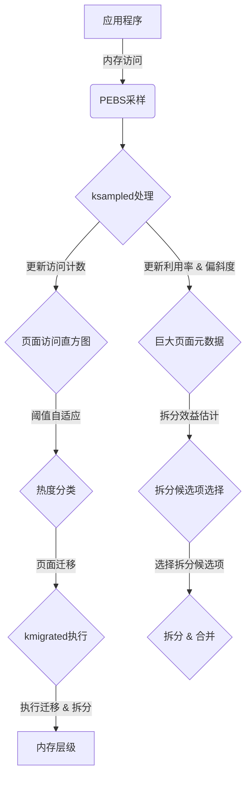

1. **内核进程**:
   - `ksampled`：这个内核后台线程负责采样内存访问，使用Intel PEBS来跟踪内存访问事件，并更新内存访问统计信息。它还负责更新两个直方图，这两个直方图用于后续的页面热度分类和巨大页面拆分决策。

   - `kmigrated`：这个内核线程负责执行页面的迁移操作，包括将页面从快速层迁移到容量层，或者反过来。它在后台运行，以避免影响应用程序的性能。

2. **内存采样信息存储**:
   - PEBS采样得到的内存访问信息存储在PEBS缓冲区中，包括访问的虚拟地址和相关进程的ID。
   - 对于巨大页面，Memtis使用Linux内核的`compound_page`结构体中的未使用空间来存储每个4KB子页面的访问元数据。

3. **内存迁移和拆分实现**:
   - `ksampled`在处理PEBS样本时，会更新页面的热度因子，并根据热度因子的变化，将页面分类为热、温或冷页面。
   - `kmigrated`会定期检查直方图，并根据当前的热度分类和内存访问模式，执行页面的晋升或降级操作。此外，`kmigrated`还负责拆分那些高度偏斜的巨大页面，即将那些只有少数子页面频繁访问的巨大页面拆分成更小的页面，以便更有效地利用快速层内存。

4. **架构图**:

**原文**:

- `ksampled`和`kmigrated`的描述可以在论文的第4节（Detailed Design of Memtis）中找到，其中详细说明了这两个线程的功能和操作。
- 内存采样信息的存储在论文的第4.1.1小节（Sampling Memory Accesses Using PEBS）中有描述，说明了如何使用PEBS来采样内存访问，并将信息存储在相应的数据结构中。
- 内存迁移和拆分的实现在第4.2（Histogram-based Hot Set Classification）和第4.3（Skewness-aware Page Size Determination）小节中有详细描述。特别是，第4.3.3小节（Page Type Conversion in the Background）讨论了拆分巨大页面的背景处理。

